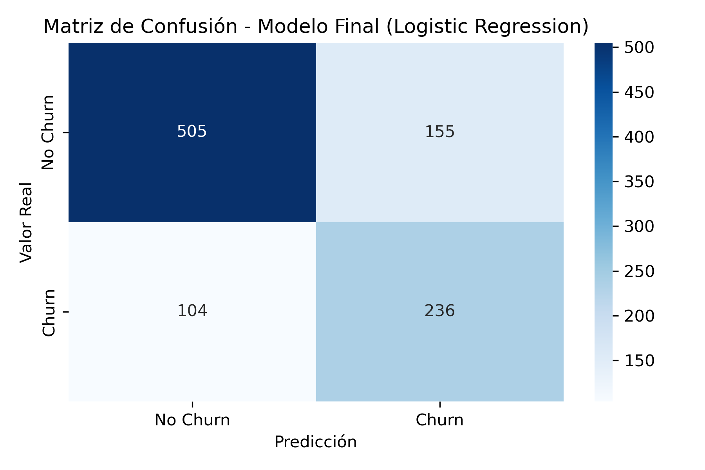
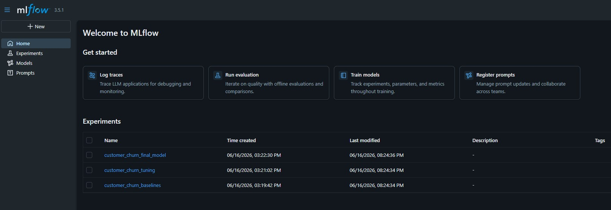
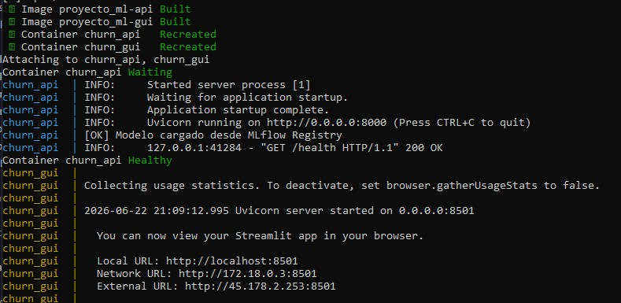
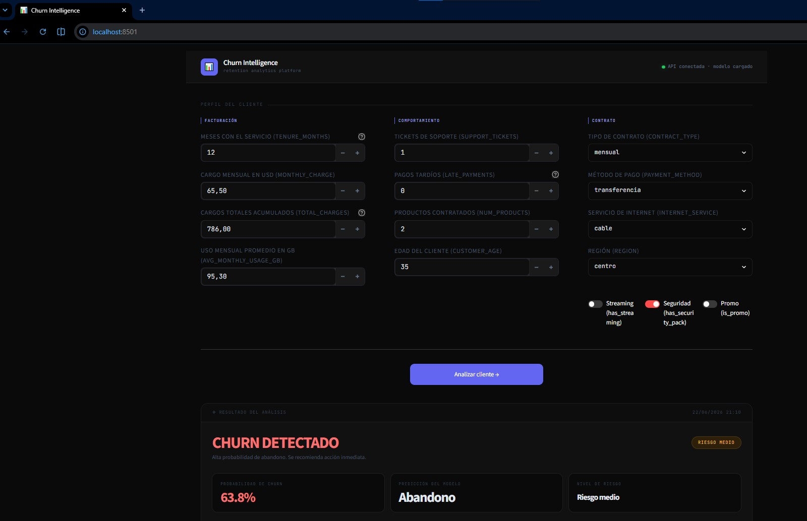
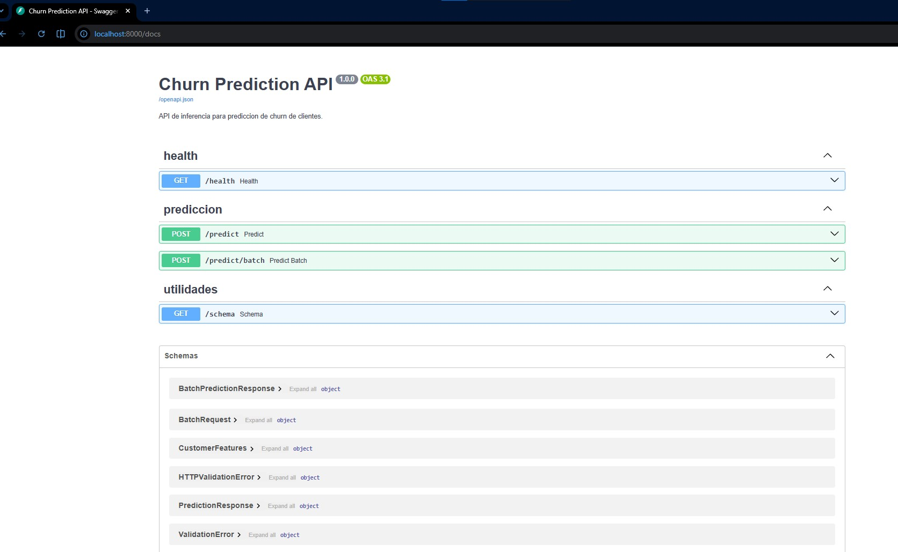
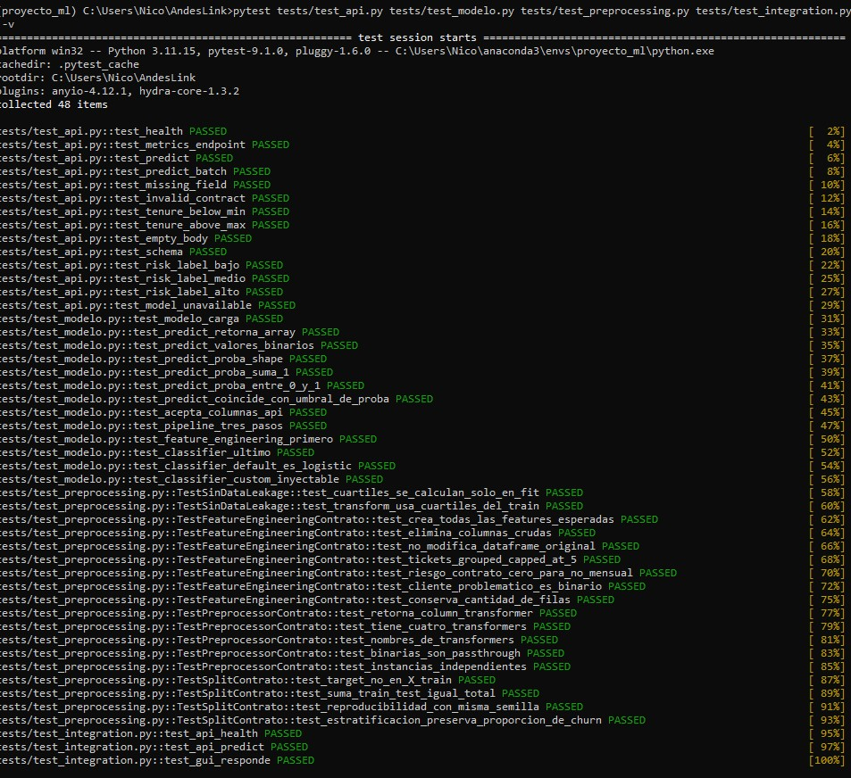
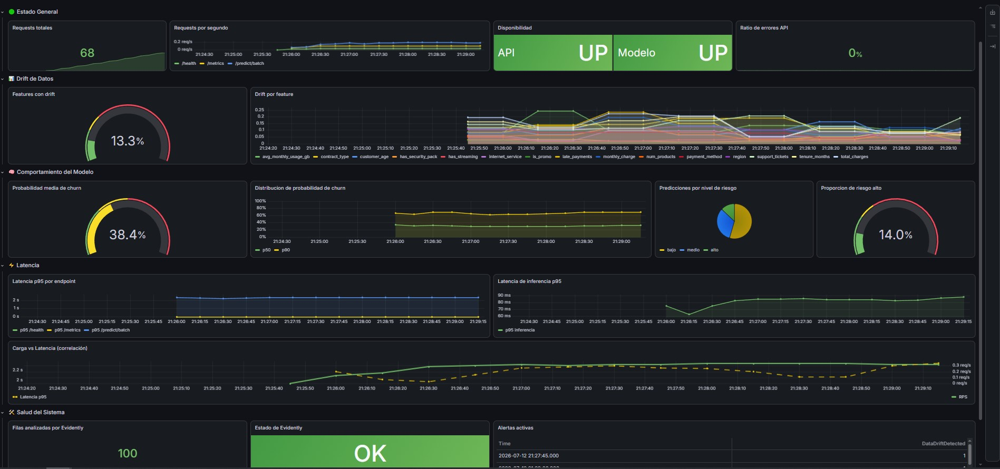
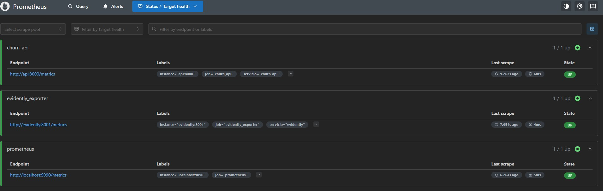

# Customer Churn Prediction — End-to-End MLOps

End-to-end Machine Learning and MLOps project focused on predicting customer churn and building a complete system for training, deployment, testing and monitoring.

The project implements the complete ML lifecycle:

**Data → Preprocessing → Feature Engineering → Model Training → Experiment Tracking → API → Deployment → Monitoring**

---

## 📌 Project Overview

The objective is to predict whether a customer is likely to churn and provide a production-oriented system capable of serving predictions and monitoring both the API and model behavior.

The project includes:

* Exploratory Data Analysis (EDA)
* Data preprocessing and feature engineering
* Comparison of Logistic Regression, Random Forest and XGBoost
* Hyperparameter tuning
* Experiment tracking with MLflow
* Data and model versioning with DVC
* Model serialization
* REST API with FastAPI
* Interactive GUI with Streamlit
* Docker and Docker Compose deployment
* Automated testing with Pytest
* API monitoring with Prometheus
* Data drift detection with Evidently
* Monitoring dashboards with Grafana
* Automated alerts for system and model-related issues

---

## 📊 Model Performance

The final model is a **Logistic Regression with L1 regularization and class weighting**.

| Metric            |     Value |
| ----------------- | --------: |
| Accuracy          | **0.741** |
| Precision (Churn) | **0.604** |
| Recall (Churn)    | **0.694** |
| F1 Score          | **0.646** |
| ROC-AUC           | **0.798** |

The final model was selected after evaluating and comparing multiple Machine Learning approaches.

### Confusion Matrix



---

## 🏗️ Project Architecture

```text
                    ┌─────────────────┐
                    │   Raw Dataset   │
                    └────────┬────────┘
                             │
                             ▼
                  ┌─────────────────────┐
                  │ Preprocessing &     │
                  │ Feature Engineering │
                  └──────────┬──────────┘
                             │
                             ▼
                  ┌─────────────────────┐
                  │ Model Training &    │
                  │ Experiment Tracking │
                  └──────────┬──────────┘
                             │
                             ▼
                    ┌─────────────────┐
                    │  Trained Model  │
                    └────────┬────────┘
                             │
                             ▼
                    ┌─────────────────┐
                    │   FastAPI API   │
                    └────────┬────────┘
                             │
                       ┌─────┴─────┐
                       ▼           ▼
                ┌────────────┐ ┌────────────┐
                │ Streamlit  │ │ Monitoring │
                │    GUI     │ │    Stack   │
                └────────────┘ └──────┬─────┘
                                      │
                               ┌──────┴──────┐
                               ▼             ▼
                          Prometheus      Grafana
                               │
                               ▼
                           Evidently
                        Data Drift Detection
```

---

## 🗂️ Repository Structure

```text
customer-churn-prediction/
├── .github/
├── data/
│   ├── raw/                        # Raw dataset
│   └── processed/                  # Processed datasets
├── docker/
│   ├── Dockerfile.api
│   ├── Dockerfile.streamlit
│   ├── Dockerfile.evidently
│   └── Dockerfile.traffic
├── models/                         # Trained model and metrics
├── monitoring/
│   ├── prometheus.yml
│   ├── rules.yml
│   └── provisioning/
├── notebooks/
│   └── notebook.ipynb              # EDA and experimentation
├── reports/                        # Technical reports and evidence
├── requirements/
│   ├── api.txt
│   ├── streamlit.txt
│   ├── monitoring.txt
│   └── traffic.txt
├── src/
│   ├── preprocessing.py
│   ├── feature_engineering.py
│   ├── train.py
│   ├── main.py
│   ├── api/
│   │   ├── api.py
│   │   ├── schemas.py
│   │   ├── metrics.py
│   │   └── inference_logger.py
│   ├── gui/
│   │   └── app.py
│   └── monitoring/
│       ├── evidently_monitor.py
│       ├── evidently_exporter.py
│       └── traffic_generator.py
├── tests/
├── tracking/
│   └── experiments.py
├── .dvcignore
├── .gitignore
├── docker-compose.yml
├── environment.yml
└── README.md
```

---

# 🛠️ Technologies

### Machine Learning

* Python
* Pandas
* NumPy
* Scikit-learn
* XGBoost

### MLOps

* DVC
* MLflow
* Docker
* Docker Compose

### Deployment

* FastAPI
* Streamlit

### Monitoring

* Prometheus
* Grafana
* Evidently

### Testing & Development

* Pytest
* Jupyter
* Conda

---

# 🚀 Getting Started

## Requirements

The following tools are required:

* **Anaconda or Miniconda**
* **Docker**
* **Docker Compose**
* **Git**

Docker is required for deployment and monitoring. Conda is used for training, notebooks, DVC and local testing.

---

## Installation

### 1. Clone the repository

```bash
git clone https://github.com/nicocarrero/customer-churn-prediction.git
cd customer-churn-prediction
```

### 2. Create the Conda environment

```bash
conda env create -f environment.yml
conda activate proyecto_ml
```

### 3. Configure DVC

Configure the DVC remote credentials locally:

```bash
dvc remote modify origin --local auth basic
dvc remote modify origin --local user TU_USUARIO_DAGSHUB
dvc remote modify origin --local password TU_TOKEN_DAGSHUB
```

> Credentials are configured locally and should never be committed to the repository.

### 4. Download data and model artifacts

```bash
dvc pull
```

This downloads the required datasets and model artifacts, including:

* `data/raw/churn_sintetico.csv`
* `data/processed/data_final.csv`
* `models/model_pipeline.joblib`

---

# 🧠 Training

Training requires the Conda environment:

```bash
conda activate proyecto_ml
```

## Run the training pipeline

```bash
python src/main.py
```

The pipeline performs:

1. Data preprocessing
2. Feature engineering
3. Model training
4. Model evaluation
5. Model serialization
6. Metrics generation
7. Confusion matrix generation

The trained model is saved to:

```text
models/model_pipeline.joblib
```

Metrics are saved to:

```text
models/metrics.json
```

---

## 🔬 Exploratory Data Analysis

The project includes a Jupyter notebook containing:

* Exploratory Data Analysis
* Data preprocessing
* Feature analysis
* Model comparison
* Feature engineering
* Model evaluation

Run it with:

```bash
jupyter lab notebooks/notebook.ipynb
```

---

## 📈 Experiment Tracking with MLflow

Experiments are tracked using **MLflow** and stored in DagsHub.

The project evaluates:

* Logistic Regression
* Random Forest
* XGBoost

Experiments can be consulted directly from the browser:

https://dagshub.com/carreronicoo/proyecto_ml.mlflow/

### Evidence

**Experiment comparison in MLflow**



**Confusion matrix of the final model**


The confusion matrices generated for the evaluated models are available in:

```text
reports/cm_exp_*.png
```

---

# 🌐 Deployment

The application can be deployed using **Docker Compose**.

The API loads the trained model from:

```text
models/model_pipeline.joblib
```

The model is included in the API Docker image during the build.

## Start API + GUI

```bash
docker compose up --build api gui
```

### Services

| Service    | URL                        |
| ---------- | -------------------------- |
| FastAPI    | http://localhost:8000      |
| Swagger UI | http://localhost:8000/docs |
| Streamlit  | http://localhost:8501      |

Stop the services:

```bash
docker compose down
```

The Streamlit GUI communicates with the FastAPI service through the internal Docker network.

---

# 🔌 API

The REST API is built with **FastAPI**.

## `POST /predict`

Receives customer information and returns a churn prediction, probability and risk level.

### Example request

```json
{
  "tenure_months": 12,
  "monthly_charge": 65.50,
  "total_charges": 786.0,
  "support_tickets": 1,
  "late_payments": 0,
  "avg_monthly_usage_gb": 95.3,
  "contract_type": "anual",
  "payment_method": "debito",
  "internet_service": "fibra",
  "has_streaming": 1,
  "has_security_pack": 0,
  "num_products": 2,
  "region": "centro",
  "customer_age": 35,
  "is_promo": 0
}
```

### Example response

```json
{
  "churn_prediction": 1,
  "churn_probability": 0.82,
  "risk_level": "alto"
}
```

Risk levels:

* **Low:** `< 0.35`
* **Medium:** `0.35 – 0.65`
* **High:** `> 0.65`

---

## API Endpoints

| Method | Endpoint         | Description                           |
| ------ | ---------------- | ------------------------------------- |
| GET    | `/health`        | Service health and model availability |
| POST   | `/predict`       | Individual prediction                 |
| POST   | `/predict/batch` | Batch predictions                     |
| GET    | `/schema`        | Customer input schema                 |
| GET    | `/metrics`       | Prometheus metrics                    |

If the model is unavailable, `/predict` and `/predict/batch` return HTTP `503`.

---

# 🧪 Testing

Unit tests require the Conda environment:

```bash
conda activate proyecto_ml
```

Run the tests:

```bash
pytest tests/test_api.py tests/test_modelo.py tests/test_preprocessing.py -v
```

### Integration test

The integration test requires Docker Compose to be running:

```bash
docker compose up -d api gui
```

Then:

```bash
pytest tests/test_integration.py -v
```

### Evidence

**Docker Compose — API + GUI**



**Streamlit GUI**



**FastAPI Swagger UI**



**Pytest**



---

# 📡 Monitoring

The project implements a complete monitoring stack using:

* Prometheus
* Grafana
* Evidently

The monitoring system tracks both **application performance** and **Machine Learning behavior**.

---

## Start the complete system

```bash
docker compose up --build
```

This starts:

* API
* Streamlit
* Traffic Generator
* Evidently Exporter
* Prometheus
* Grafana

### Services

| Service            | URL                           |
| ------------------ | ----------------------------- |
| FastAPI            | http://localhost:8000         |
| Streamlit          | http://localhost:8501         |
| Evidently Exporter | http://localhost:8001/metrics |
| Prometheus         | http://localhost:9090         |
| Grafana            | http://localhost:3000         |

---

## 🚦 Traffic Generator

The traffic generator simulates customer requests against `/predict`.

It samples the original dataset and can inject controlled synthetic data drift using:

```text
DATA_DRIFT_PROB
```

The generated data is stored in:

```text
data/processed/current_data.csv
```

Evidently uses this dataset as the current production-like dataset for drift analysis.

---

## 📊 API Metrics

The API exposes Prometheus metrics such as:

* `api_requests_total`
* `api_request_latency_seconds`
* `api_request_errors_total`
* `model_availability`
* `model_inference_duration_seconds`
* `churn_predictions_total`
* `churn_probability_score`
* `mlops_churn_probability_mean`

---

## 🔎 Evidently Metrics

The Evidently exporter exposes metrics including:

* `mlops_drifted_features_ratio`
* `mlops_feature_drift_score{feature=...}`
* `mlops_current_rows`
* `mlops_high_risk_ratio`
* `mlops_evidently_report_success`
* `mlops_evidently_last_run_timestamp`

---

## 🚨 Alerts

Prometheus alert rules are defined in:

```text
monitoring/rules.yml
```

The project includes alerts for:

| Alert                       | Condition                    |
| --------------------------- | ---------------------------- |
| `APIDown`                   | API unavailable for 1 minute |
| `ModelUnavailable`          | Model not loaded             |
| `EvidentlyExporterDown`     | Exporter unavailable         |
| `HighRequestLatencyP95`     | HTTP p95 latency > 1s        |
| `HighModelInferenceLatency` | Model inference p95 > 0.5s   |
| `HighErrorRate`             | Error rate > 5%              |
| `DataDriftDetected`         | >30% of features show drift  |
| `EvidentlyReportFailed`     | Evidently analysis failure   |

---

# 📊 Grafana Dashboard

Grafana is automatically provisioned with the Prometheus datasource and the MLOps dashboard.

No manual configuration is required.

### Evidence

**Grafana Dashboard**



**Prometheus**



---

## 📈 Evidently Report

The monitoring process compares:

```text
Reference dataset:
data/raw/churn_sintetico.csv

Current dataset:
data/processed/current_data.csv
```

Evidently analyzes the differences between both datasets and publishes the results as Prometheus metrics.

The exporter executes the analysis periodically according to:

```text
RUN_INTERVAL
```

The default interval is **30 seconds**.

---

# 📚 Additional Documentation

For more detailed information about the implementation:

* **Technical Report:** `reports/INFORME_TECNICO.md`
* **Exploratory Notebook:** `notebooks/notebook.ipynb`

---
